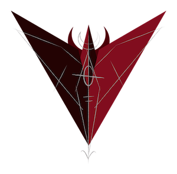

# Front-End Base Project

A simple front-end base project using my preferred stack as of 2020.

## Stack

* Webpack 4
* Babel 7
* React 16
* Redux 4
* Scss
* JestEnzyme 

## ToDo:
* Optimize Bundles

# Dedications

I dedicate this little project to:

1. The _God of Magick_, in whatever form and name he might take. Hail, Hermes!
2. The _Prince of Darkness_, in whatever form and name he might take. Hail, _Horned Lord_!
3. Myself, and the Black Flame that burns inside me and makes it possible for me to get inspired and do magick.

